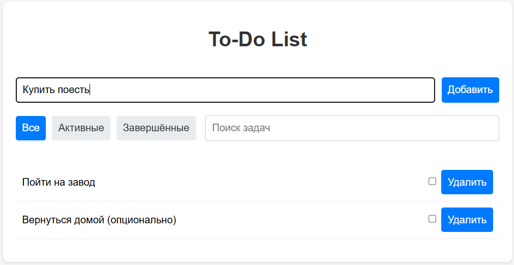
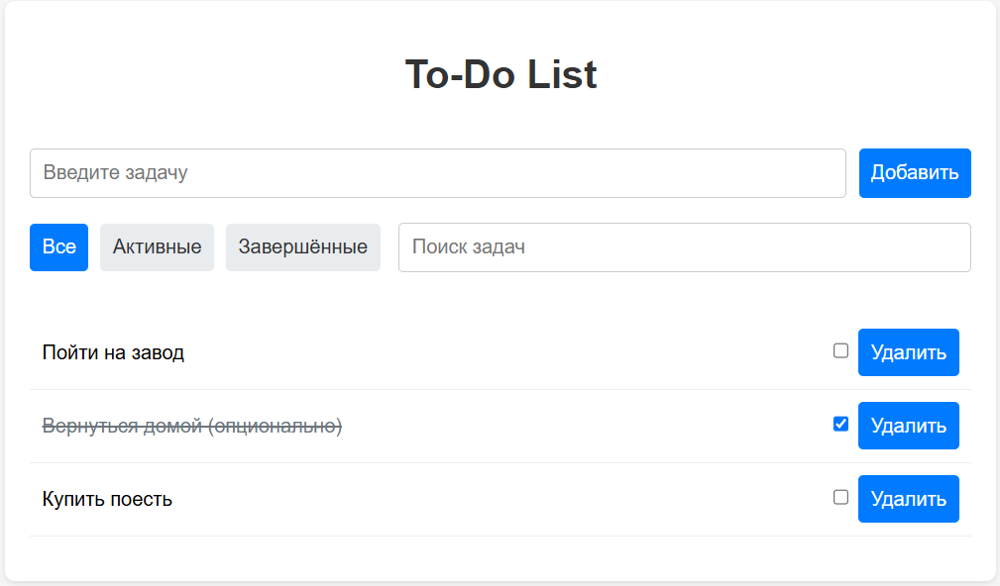
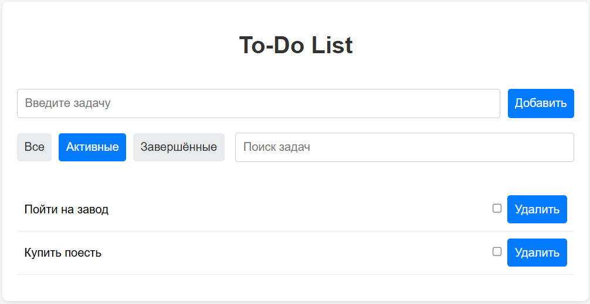
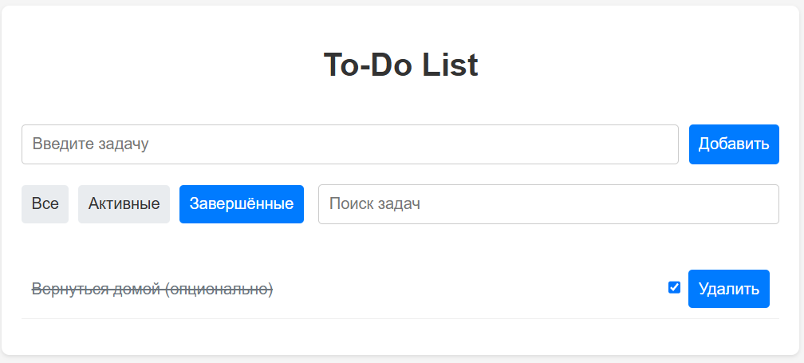
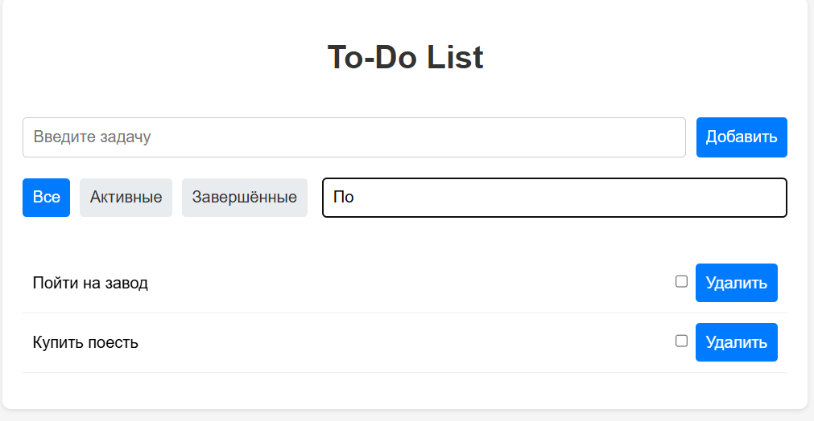
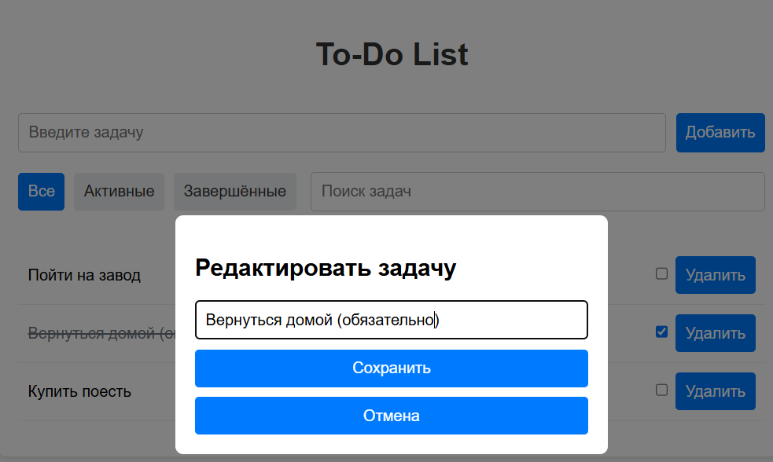

# Индивидуальная работа. Шклярук Артур IA2404

## Описание проекта
To-Do List — это веб-приложение для управления задачами, разработанное на чистом JavaScript (Vanilla JS). Пользователи могут добавлять, удалять, отмечать их как завершенные, а также выполнять фильтрацию по статусу (все, активные, завершенные) и поиск по ключевому слову. Проект демонстрирует навыки работы с DOM, обработкой событий, валидацией ввода и управлением данными.

**Цель**: Развитие и подтверждение практических навыков программирования на JavaScript в соответствии с требованиями учебной дисциплины.

## Основные функции
- **Добавление задач**: Ввод новой задачи через форму с валидацией (не допускается пустой ввод).
- **Удаление задач**: Удаление задачи по нажатию кнопки "Удалить".
- **Отметка завершения**: Использование чекбокса для переключения статуса задачи (завершена/не завершена).
- **Фильтрация**: Отображение всех, активных или завершенных задач.
- **Поиск**: Поиск задач по частичному совпадению названия.
- **Изменение контента**: Функция по изменению существующих задач.

## Установка и запуск
1. **Склонируйте или скачайте проект:**

- Если проект загружен на GitHub, склонируйте его с помощью команды:

    ```bash
    git clone <ссылка_на_репозиторий>
    ```
- Либо скачайте ZIP-архив и распакуйте его.

2. **Откройте проект в Visual Studio Code:**

- Откройте папку "Individual work" в VS Code.


3. **Установите расширение Live Server (рекомендуется):**

- В VS Code откройте раздел расширений (Ctrl+Shift+X или Cmd+Shift+X на macOS).

- Найдите Live Server от Ritwick Dey и установите его.

4. **Запустите проект:**

- Щелкните правой кнопкой мыши на index.html в проводнике VS Code.

- Выберите "Open with Live Server".

- Проект откроется в браузере автоматически.

---

Примечание: Запуск через file:// (двойным кликом на index.html) не поддерживается из-за использования модулей ES (type="module"), что вызывает ошибки CORS. Используйте локальный сервер.

---

## Примеры использования
1. **Добавление задачи**:
   - Введите название задачи в поле ввода и нажмите "Добавить".
   - Если поле пустое, появится сообщение об ошибке.


2. **Изменение состояния задачи**:
   - Нажмите на checkbox в правой стороне задачи, чтобы объявить её "Завершённой".
   - При повторном нажатии задача возвращается в состояние "Активной".
 

3. **Фильтрация и поиск**:
   - Используйте кнопки "Все", "Активные", "Завершённые" для фильтрации.
   
   ---
   
   - Введите запрос в поле поиска для фильтрации по названию.
   

4. **Изменение задачи**:
   - Нажмите левой кнопкой мыши по названию задачи, чтобы вызвать отдельное окно для изменения имени задачи. Нажмите "Сохранить", чтобы сохранить изменения.
   

## Вывод
В ходе выполнения индивидуального задания был разработан функциональный веб-сервис To-Do List, реализованный на чистом JavaScript без использования сторонних библиотек или фреймворков. Приложение демонстрирует практическое применение работы с DOM, событийной моделью браузера, валидацией данных и реализацией пользовательского интерфейса.

Были успешно реализованы ключевые функции управления задачами: добавление, удаление, редактирование, фильтрация, поиск и переключение статуса выполнения. Также были внедрены механизмы визуальной обратной связи и модальное окно редактирования задач.