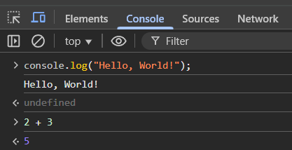
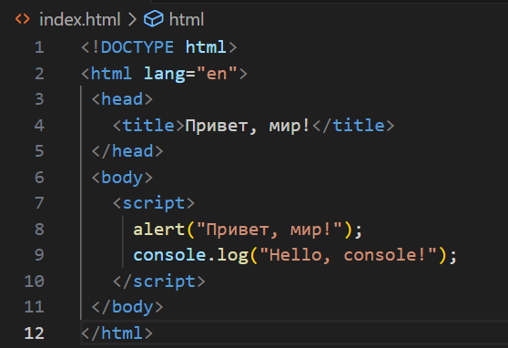
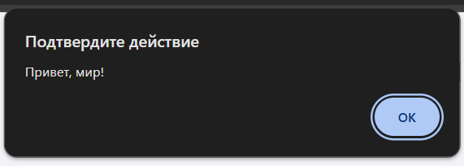
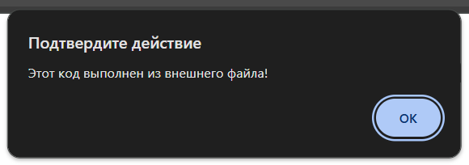
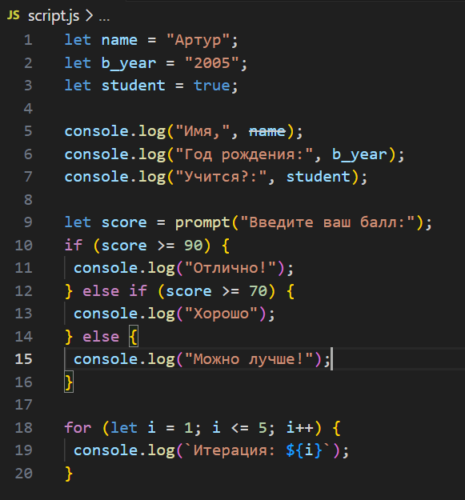
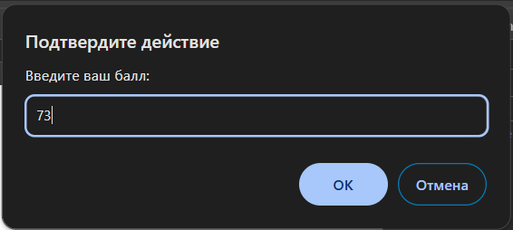
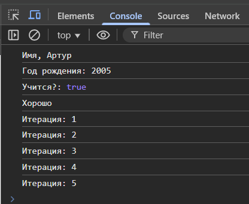

# Отчет о лабораторной работе номер 1
# Шклярук Артур IA2404

## Инструкции по запуску проекта

1. **Установите текстовый редактор**
   - Рекомендуемый: [Visual Studio Code (VS Code)](https://code.visualstudio.com/).
   
2. **Установите Node.js**
   - Скачайте и установите с [официального сайта](https://nodejs.org/).
   
3. **Запустите DevTools в браузере**
   - Откройте браузер, нажмите `F12`, выберите вкладку `Console`.
   
4. **Выполнение JavaScript-кода в браузере**
   - Откройте консоль разработчика (`F12 → Console`).
   - Введите команду `console.log("Hello, world!");` и нажмите `Enter`.
   - Введите `2 + 3` и посмотрите результат.

5. **Создайте HTML-страницу с JavaScript**
   - Создайте файл `index.html` и вставьте код:
     ```html
     <!DOCTYPE html>
     <html lang="en">
     <head>
       <title>Привет, мир!</title>
     </head>
     <body>
       <script>
         alert("Привет, мир!");
         console.log("Hello, console!");
       </script>
     </body>
     </html>
     ```
   - Откройте `index.html` в браузере.

6. **Подключение внешнего JavaScript-файла**
   - Создайте файл `script.js` и добавьте код:
     ```js
     alert("Этот код выполнен из внешнего файла!");
     console.log("Сообщение в консоли");
     ```
   - Подключите его в `index.html`:
     ```html
     <script src="script.js"></script>
     ```
   - Откройте страницу в браузере.

## Описание лабораторной работы

**Цель:** Изучить основы JavaScript в браузере, научиться работать с консолью и создавать простые скрипты.

**Задачи:**
- Выполнить JavaScript-код в консоли браузера.
- Написать HTML-страницу с встроенным и внешним JS-кодом.
- Изучить работу с переменными и типами данных.
- Использовать условные операторы и циклы.

## Краткая документация к проекту

### Переменные и типы данных

Пример объявления переменных:
```js
let name = "Артур";
let birthYear = 2005;
let isStudent = true;
```
Вывод в консоль:
```js
console.log("Имя:", name);
console.log("Год рождения:", birthYear);
console.log("Учится?:", isStudent);
```

### Условные операторы
```js
let score = prompt("Введите ваш балл:");
if (score >= 90) {
  console.log("Отлично!");
} else if (score >= 70) {
  console.log("Хорошо");
} else {
  console.log("Можно лучше!");
}
```

### Циклы
```js
for (let i = 1; i <= 5; i++) {
  console.log(`Итерация: ${i}`);
}
```
___
## Скриншоты работы
Ввожу `console.log("Hello, World!");` и `2 + 3` в консоль (`F12`) и проверяю



Использую код html сайта 



Проверяю результат кода html сайта



Присоединяю новый документ `script.js` при помощи команды `<script src="script.js"></script>`, а в самом файле прописываю команду `alert("Этот код выполнен из внешнего файла!"); console.log("Сообщение в консоли");`

В итоге команда из файла `.js` сработала первее похожей команды в `.html`



Меняю содержимое `script.js`:

* Объявляю три новые пременные
* Вывожу в консоль текс и значения переменных
* Использую условия и циклы данные в примере



При запуске программы сначала открывается окно, в которое нужно ввести свой балл



Далее в консоли происходят все действия, описанные в `script.js`

