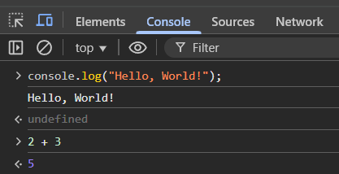
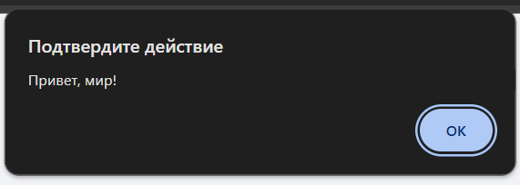
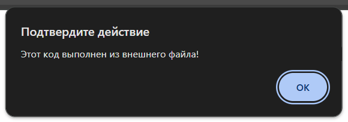
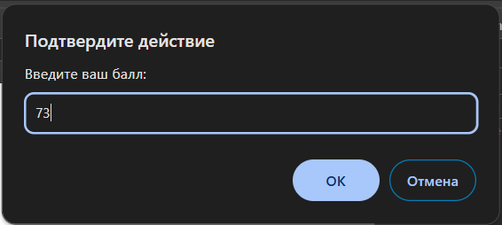
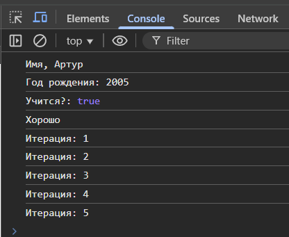

# Отчет о лабораторной работе номер 1
## Шклярук Артур IA2404

## Описание лабораторной работы

**Цель:** Изучить основы JavaScript в браузере, научиться работать с консолью и создавать простые скрипты.

**Задачи:**
- Выполнить JavaScript-код в консоли браузера.
- Написать HTML-страницу с встроенным и внешним JS-кодом.
- Изучить работу с переменными и типами данных.
- Использовать условные операторы и циклы.

## Инструкции по запуску проекта

1. **Установите текстовый редактор**
  - Рекомендуемый: [Visual Studio Code (VS Code)](https://code.visualstudio.com/).
   
2. **Установите Node.js**
  - Скачайте и установите с [официального сайта](https://nodejs.org/).
   
## Выполнение лабораторной работы

1. **Запуск DevTools в браузере**
  - Откройте браузер, нажмите `F12`, выберите вкладку `Console`.
   
2. **Выполнение JavaScript-кода в браузере**
  - Открываю консоль разработчика (`F12 → Console`).
  - Ввожу команду `console.log("Hello, world!");` и нажимаю `Enter`.
  - Ввожу `2 + 3` и просматриваю результат результат.

   

3. **Создание HTML-страницу с JavaScript**
  - Создаю файл `index.html` и вставляю код:
     ```html
     <!DOCTYPE html>
     <html lang="en">
     <head>
       <title>Привет, мир!</title>
     </head>
     <body>
       <script>
         alert("Привет, мир!");
         console.log("Hello, console!");
       </script>
     </body>
     </html>
     ```
  - Открываю `index.html` в браузере и вижу результат




4. **Подключение внешнего JavaScript-файла**
  - Создаю файл `script.js` и добавляю код:
     ```js
     alert("Этот код выполнен из внешнего файла!");
     console.log("Сообщение в консоли");
     ```
  - Подключаю его в `index.html`:
     ```html
     <script src="script.js"></script>
     ```
  - Открываю страницу в браузере и вижу результат



5. **Создание новых переменных**
  - В файле `script.js` создаю новые перменные оператором `let`
```js
let name = "Артур";
let b_year = 2005;
let student = true;
```
  - Вывожу на консоль текст + значения переменных 
```js
console.log("Имя:", name);
console.log("Год рождения:", b_year);
console.log("Учится?:", student);
```

6. **Создание условных операторов**
  - Использую условные операторы, данные в примере
```js
let score = prompt("Введите ваш балл:");
if (score >= 90) {
  console.log("Отлично!");
} else if (score >= 70) {
  console.log("Хорошо");
} else {
  console.log("Можно лучше!");
}
```

7. **Создание циклов**
  - Использую циклы, данные в примере
```js
for (let i = 1; i <= 5; i++) {
  console.log(`Итерация: ${i}`);
}
```
8. **Проверка конечного результата**
  - Открываю `index.html` и меня встречает alert с просьбой ввести балл



  - Далее открываю консоль и вижу всю выведенную информацию



## Контрольные вопросы
1. **Разница между `var`, `let` и `const`**

В JavaScript существуют три способа объявления переменных: var, let и const, и у них есть ключевые различия.

  - `var`

Доступна в пределах всей функции, если объявлена внутри функции, или в глобальной области видимости, если объявлена вне функции.
Подвержена hoisting (всплытию) – переменная может быть использована до объявления, но её значение будет undefined.
Можно переопределять и повторно объявлять в одной области видимости.

- `let`

Блочная область видимости (ограничена блоком кода), что делает её более безопасной.
Подвержена hoisting, но не инициализируется (использование до объявления вызовет ошибку).
Можно переопределять, но нельзя повторно объявлять в той же области.

- `const`

Также имеет блочную область видимости.
Должна быть инициализирована при объявлении.
Нельзя переопределить (но если это объект или массив, то можно изменять его свойства).

2. **Неявное преобразование типов в JavaScript**

Неявное (или автоматическое) преобразование типов происходит, когда JavaScript автоматически приводит значения разных типов друг к другу.

Это поведение может привести к неожиданным ошибкам, поэтому лучше использовать явное приведение типов `Number()`, `String()`, `Boolean()`.

3. Разница между `==` и `===`

- `==` (абстрактное сравнение) не учитывает типы, но приводит их к одному.

- `===` (строгое сравнение) учитывает и значение, и тип.

## Библиография
1. [Учебник JavaScript](https://learn.javascript.ru/)
2. [Переменные](https://learn.javascript.ru/variables)
3. [If, else](https://learn.javascript.ru/ifelse)
4. [Циклы](https://learn.javascript.ru/while-for)
