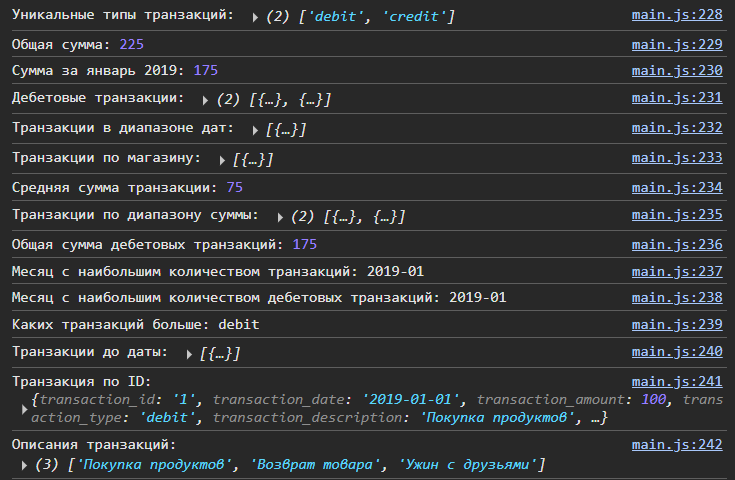
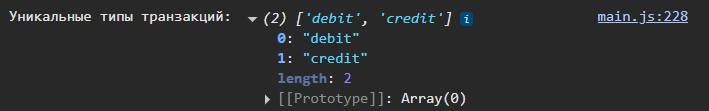
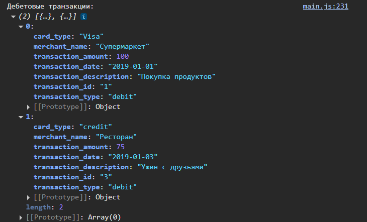
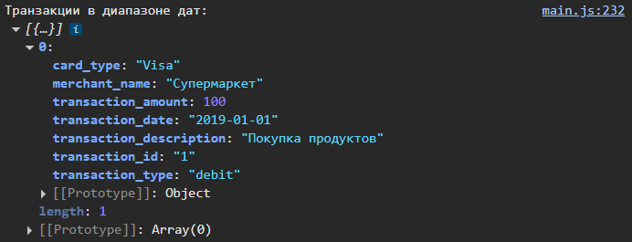
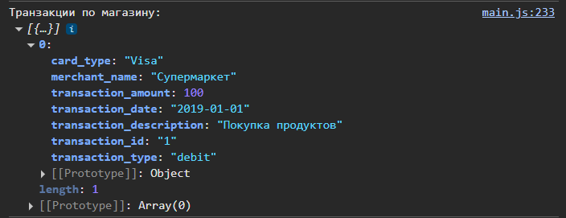
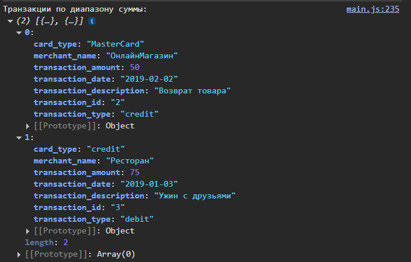
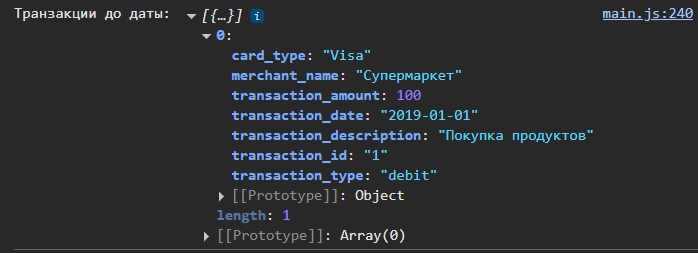
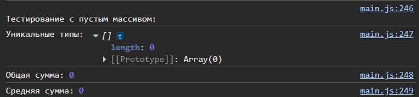
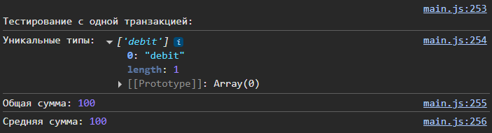

# Лабораторная работа №2 (Шклярук Артур (IA2404))
# Тема: основы работы с массивами, функциями и объектами в JavaScript

## Цель работы

Изучить основы работы с массивами и функциями в JavaScript, применяя их для обработки и анализа транзакций.

## Описание задачи

В рамках лабораторной работы был разработан набор функций для обработки массива транзакций. Каждая транзакция представлена объектом с определёнными свойствами, такими как идентификатор, дата, сумма, тип (дебетовая или кредитная), описание, название магазина и тип карты. Были реализованы функции для анализа данных, фильтрации, подсчёта сумм и других операций с транзакциями.

## Структура проекта

1. **Тип данных**: Определён тип `Transaction` с помощью JSDoc для описания структуры объекта транзакции.
2. **Функции**: Реализовано 15 функций для выполнения различных операций с массивом транзакций.
3. **Тестирование**: Проведено тестирование на тестовом наборе данных, пустом массиве и массиве с одной транзакцией.

### Тип данных `Transaction`

```javascript
/**
 * {Object} Transaction
 * {string} transaction_id - Уникальный идентификатор транзакции
 * {string} transaction_date - Дата транзакции (ГГГГ-ММ-ДД)
 * {number} transaction_amount - Сумма транзакции
 * {"debit"|"credit"} transaction_type - Тип транзакции (расход/приход)
 * {string} transaction_description - Описание транзакции
 * {string} merchant_name - Название магазина/сервиса
 * {string} card_type - Тип карты (Visa, MasterCard и т.д.)
 */
```

### Реализуемые функции

Ниже приведены все реализуемые функции с их описанием и кодом:

1. **`getUniqueTransactionTypes`** — возвращает массив уникальных типов транзакций.

```javascript
function getUniqueTransactionTypes(transactions) {
    const types = transactions.map(t => t.transaction_type);
    return [...new Set(types)];
}
```
2. **`calculateTotalAmount`** — вычисляет общую сумму всех транзакци
```javascript
function calculateTotalAmount(transactions) {
    return transactions.reduce((total, t) => total + t.transaction_amount, 0);
}
```
3. **`calculateTotalAmountByDate`** - вычисляет сумму транзакций за указанную дату или период
```javascript
function calculateTotalAmountByDate(transactions, year, month, day) {
    return transactions.reduce((total, t) => {
        const date = new Date(t.transaction_date);
        const matchesYear = year === undefined || date.getFullYear() === year;
        const matchesMonth = month === undefined || date.getMonth() + 1 === month;
        const matchesDay = day === undefined || date.getDate() === day;
        return (matchesYear && matchesMonth && matchesDay) ? total + t.transaction_amount : total;
    }, 0);
}
```
4. **`getTransactionByType`** — возвращает транзакции указанного типа (debit/credit).
```javascript
function getTransactionByType(transactions, type) {
    return transactions.filter(t => t.transaction_type === type);
}
```
5. **`getTransactionsInDateRange`** — возвращает транзакции в указанном диапазоне дат.
```javascript
function getTransactionsInDateRange(transactions, startDate, endDate) {
    const start = new Date(startDate);
    const end = new Date(endDate);
    return transactions.filter(t => {
        const date = new Date(t.transaction_date);
        return date >= start && date <= end;
    });
}
```
6. **`getTransactionsByMerchant`** — возвращает транзакции указанного магазина.
```javascript
function getTransactionsByMerchant(transactions, merchantName) {
    return transactions.filter(t => t.merchant_name === merchantName);
}
```
7. **`calculateAverageTransactionAmount`** — вычисляет среднюю сумму транзакций.
```javascript
function calculateAverageTransactionAmount(transactions) {
    if (transactions.length === 0) return 0;
    return calculateTotalAmount(transactions) / transactions.length;
}
```
8. **`getTransactionsByAmountRange`** — возвращает транзакции в указанном диапазоне сумм.
```javascript
function getTransactionsByAmountRange(transactions, minAmount, maxAmount) {
    return transactions.filter(t => t.transaction_amount >= minAmount && t.transaction_amount <= maxAmount);
}
```
9. **`calculateTotalDebitAmount`** — вычисляет общую сумму дебетовых транзакций.
```javascript
function calculateTotalDebitAmount(transactions) {
    return getTransactionByType(transactions, 'debit').reduce((total, t) => total + t.transaction_amount, 0);
}
```
10. **`findMostTransactionsMonth`** — находит месяц с наибольшим количеством транзакций.
```javascript
function findMostTransactionsMonth(transactions) {
    const monthCounts = {};
    transactions.forEach(t => {
        const date = new Date(t.transaction_date);
        const monthKey = `${date.getFullYear()}-${String(date.getMonth() + 1).padStart(2, '0')}`;
        monthCounts[monthKey] = (monthCounts[monthKey] || 0) + 1;
    });
    return Object.entries(monthCounts).sort((a, b) => b[1] - a[1])[0][0];
}
```
11. **`findMostDebitTransactionMonth`** — находит месяц с наибольшим количеством дебетовых транзакций.
```javascript
function findMostDebitTransactionMonth(transactions) {
    const debitTransactions = getTransactionByType(transactions, 'debit');
    return findMostTransactionsMonth(debitTransactions);
}
```
12. **`mostTransactionTypes`** — определяет, каких транзакций больше (debit/credit/equal).
```javascript
function mostTransactionTypes(transactions) {
    const debitCount = getTransactionByType(transactions, 'debit').length;
    const creditCount = getTransactionByType(transactions, 'credit').length;
    if (debitCount > creditCount) return 'debit';
    if (creditCount > debitCount) return 'credit';
    return 'equal';
}
```
13. **`getTransactionsBeforeDate`** — возвращает транзакции до указанной даты.
```javascript
function getTransactionsBeforeDate(transactions, date) {
    const cutoff = new Date(date);
    return transactions.filter(t => new Date(t.transaction_date) < cutoff);
}
```
14. **`findTransactionById`** — находит транзакцию по её идентификатору.
```javascript
function findTransactionById(transactions, id) {
    return transactions.find(t => t.transaction_id === id);
}
```
15. **`mapTransactionDescriptions`** — преобразует транзакции в массив их описаний.
```javascript
function mapTransactionDescriptions(transactions) {
    return transactions.map(t => t.transaction_description);
}
```
---
## Тестирование
Для проверки корректности работы функций были использованы следующие наборы данных:
### Тестовый массив транзакций
```javascript
const testTransactions = [
    {
        transaction_id: "1",
        transaction_date: "2019-01-01",
        transaction_amount: 100.0,
        transaction_type: "debit",
        transaction_description: "Покупка продуктов",
        merchant_name: "Супермаркет",
        card_type: "Visa",
    },
    {
        transaction_id: "2",
        transaction_date: "2019-02-02",
        transaction_amount: 50.0,
        transaction_type: "credit",
        transaction_description: "Возврат товара",
        merchant_name: "ОнлайнМагазин",
        card_type: "MasterCard",
    },
    {
        transaction_id: "3",
        transaction_date: "2019-01-03",
        transaction_amount: 75.0,
        transaction_type: "debit",
        transaction_description: "Ужин с друзьями",
        merchant_name: "Ресторан",
        card_type: "Visa",
    },
];
```
### Тесты
```javascript
console.log('Уникальные типы транзакций:', getUniqueTransactionTypes(testTransactions));
console.log('Общая сумма:', calculateTotalAmount(testTransactions));
console.log('Сумма за январь 2019:', calculateTotalAmountByDate(testTransactions, 2019, 1));
console.log('Дебетовые транзакции:', getTransactionByType(testTransactions, 'debit'));
console.log('Транзакции в диапазоне дат:', getTransactionsInDateRange(testTransactions, '2019-01-01', '2019-01-02'));
console.log('Транзакции по магазину:', getTransactionsByMerchant(testTransactions, 'Супермаркет'));
console.log('Средняя сумма транзакции:', calculateAverageTransactionAmount(testTransactions));
console.log('Транзакции по диапазону суммы:', getTransactionsByAmountRange(testTransactions, 50, 75));
console.log('Общая сумма дебетовых транзакций:', calculateTotalDebitAmount(testTransactions));
console.log('Месяц с наибольшим количеством транзакций:', findMostTransactionsMonth(testTransactions));
console.log('Месяц с наибольшим количеством дебетовых транзакций:', findMostDebitTransactionMonth(testTransactions));
console.log('Каких транзакций больше:', mostTransactionTypes(testTransactions));
console.log('Транзакции до даты:', getTransactionsBeforeDate(testTransactions, '2019-01-03'));
console.log('Транзакция по ID:', findTransactionById(testTransactions, '1'));
console.log('Описания транзакций:', mapTransactionDescriptions(testTransactions));

// Тестирование с пустым массивом
const emptyTransactions = [];
console.log('\nТестирование с пустым массивом:');
console.log('Уникальные типы:', getUniqueTransactionTypes(emptyTransactions));
console.log('Общая сумма:', calculateTotalAmount(emptyTransactions));
console.log('Средняя сумма:', calculateAverageTransactionAmount(emptyTransactions));

// Тестирование с одной транзакцией
const singleTransaction = [testTransactions[0]];
console.log('\nТестирование с одной транзакцией:');
console.log('Уникальные типы:', getUniqueTransactionTypes(singleTransaction));
console.log('Общая сумма:', calculateTotalAmount(singleTransaction));
console.log('Средняя сумма:', calculateAverageTransactionAmount(singleTransaction));
```
---
## Результаты тестирования
### 1. Тестовый массив транзакций:
 

Основной скриншот консоли, куда были выведены результаты работы с тестовым массивом транзакций (15 функций)
 
 1.1 "Развёрнутый" ответ на уникальные типы транзакций:
 

 1.2 "Развёрнутый" ответ на дебетовые транзакции:
  

 1.3 "Развёрнутый" ответ на транзакции в диапазоне дат:
  

 1.4 "Развёрнутый" ответ на транзакции по магазину:
  

 1.5 "Развёрнутый" ответ на транзакции по диапазону дат:
  

 1.6 "Развёрнутый" ответ на транзакции до даты:
  

---
### 2. Тестовый пустой массив:
 

Так как мало, что может получиться от работы с пустым массивом я использовал только 3 функции:

1. `getUniqueTransactionTypes`
2. `calculateTotalAmount`
3. `calculateAverageTransactionAmount`

Результатом стали 0 и пустые ответы.

---
### 3. Работа с одной транзакцией:
 

Работая с теми же функциями, что и с пустым массивом:

1. `getUniqueTransactionTypes`
2. `calculateTotalAmount`
3. `calculateAverageTransactionAmount`

Я получил результат в качестве **одного уникального типа**, **общей суммы равной сумме одной этой транзакции**, **среднюю сумму равную сумме одной этой транзакции**.

## Вывод
В ходе выполнения лабораторной работы были изучены и применены основы работы с массивами, функциями и объектами в JavaScript.

## Контрольные вопросы
### **Какие методы массивов можно использовать для обработки объектов в JavaScript?**

* `forEach` — перебор элементов.
* `map` — создание нового массива с преобразованными элементами.
* `filter` — фильтрация элементов по условию.
* `reduce` — сведение массива к одному значению.
* `find` — поиск первого подходящего элемента.
* `some` — проверка, есть ли элемент с условием.
* `every` — проверка, все ли элементы подходят.
* `sort` — сортировка массива.
---
### **Как сравнивать даты в строковом формате в JavaScript?**
В JavaScript для сравнения дат в строковом формате необходимо, чтобы даты были представлены в одном стандартном формате, который можно корректно сравнивать. Наиболее удобный — YYYY-MM-DD, даты в этом формате можно сравнивать как обычные строки.

---
### **В чем разница между map(), filter() и reduce() при работе с массивами объектов?**

* `map()` — преобразует элементы, возвращает новый массив той же длины.
* `filter()` — отбирает элементы по условию, возвращает новый массив меньшей или равной длины.
* `reduce()` — сводит массив к одному значению (например, сумме).
---
