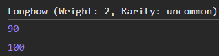

# Лабораторная работа №3 (Шклярук Артур, IA2404)
## Тема: Продвинутые объекты в JavaScript

## Цель работы
Познакомиться с классами и объектами в JavaScript, научиться создавать классы, использовать конструкторы и методы, а также реализовать наследование.

## Ход работы
### Шаг 1. Создание класса Item
Был создан базовый класс `Item` для представления предметов в инвентаре.

Основные характеристики:
- Поля: `name` (строка), `weight` (число), `rarity` (строка)
- Методы:
  - `getInfo()` - возвращает информацию о предмете
  - `setWeight(newWeight)` - изменяет вес предмета

Пример кода:
```javascript
class Item {
    constructor(name, weight, rarity) {
        this.name = name;
        this.weight = weight;
        this.rarity = rarity;
    }

    getInfo() {
        return `${this.name} (Weight: ${this.weight}, Rarity: ${this.rarity})`;
    }

    setWeight(newWeight) {
        this.weight = newWeight;
    }
}
```
---
### Шаг 2. Создание класса Weapon
Был создан класс `Weapon`, наследующийся от `Item`, для представления оружия.

Дополнительные характеристики:
- Поля: `damage` (число), `durability` (число)
- Методы:
  - `use()` - уменьшает прочность на 10
  - `repair()` - восстанавливает прочность до 100

Пример кода:
```javascript
class Weapon extends Item {
    constructor(name, weight, rarity, damage, durability) {
        super(name, weight, rarity);
        this.damage = damage;
        this.durability = durability;
    }

    use() {
        if (this.durability > 0) this.durability -= 10;
    }

    repair() {
        this.durability = 100;
    }
}
```
---
### Шаг 3. Примеры использования и выводы в консоль
Пример использования:
```javascript
const bow = new Weapon("Longbow", 2.0, "uncommon", 15, 100);
console.log(bow.getInfo());   // "Longbow (Weight: 2, Rarity: uncommon)"
bow.use();
console.log(bow.durability);  // 90
bow.repair();
console.log(bow.durability);  // 100
```

Выводы в консоль:




Вывод в консоли:
- Название оружия (`Longbow`), вес (`2`), редкость (`uncommon`)
- Сколько осталось прочности у оружия после "использования" (`90`)
- Чему равно количество прочности после использования "починки" (`100`)
---
### Выводы
1. Познакомились с концепцией классов и объектов в JavaScript через создание классов `Item` и `Weapon`.
2. Научились создавать классы с использованием ключевого слова `class`.
3. Освоили применение конструкторов для инициализации объектов и методы для работы с их свойствами.
4. Реализовали наследование, создав класс `Weapon`, расширяющий `Item`, с использованием `extends` и `super`.
---

### Библиография
1. [Учебник по js](https://learn.javascript.ru/)
2. [Статья по теме class](https://learn.javascript.ru/class)
---
