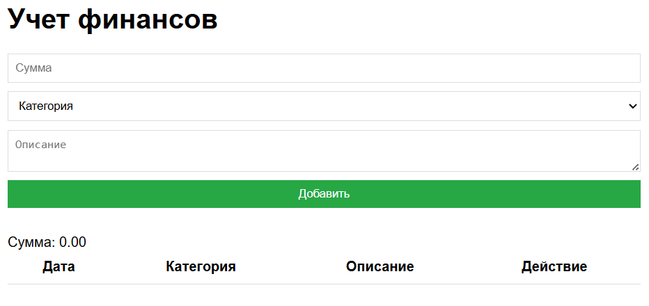
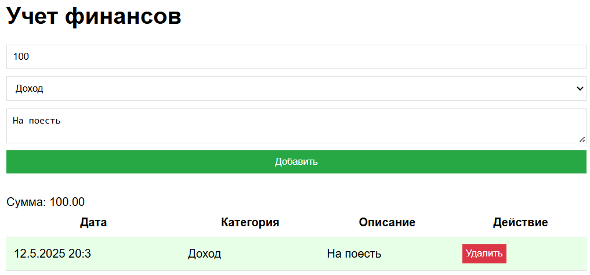
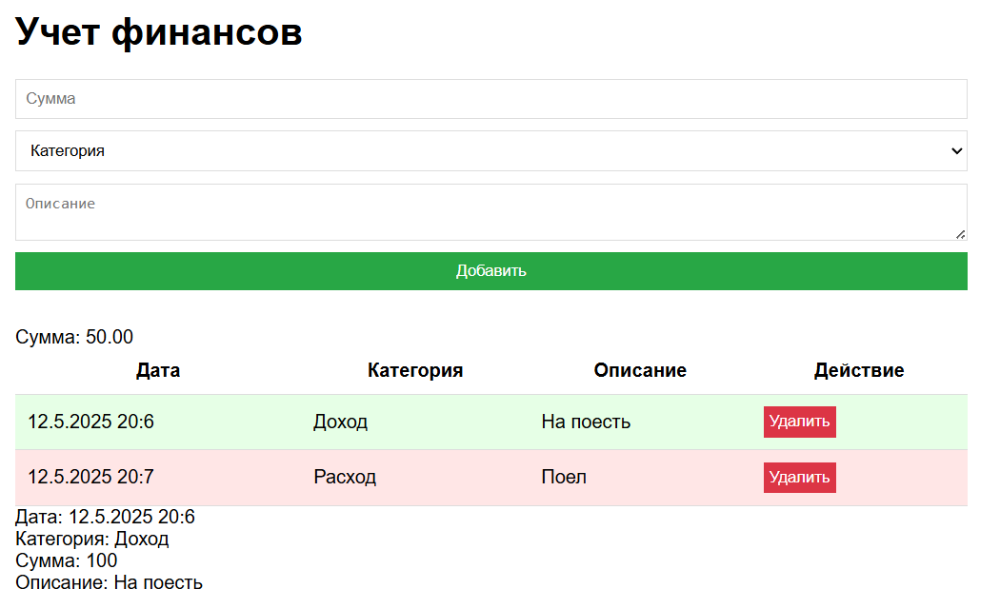
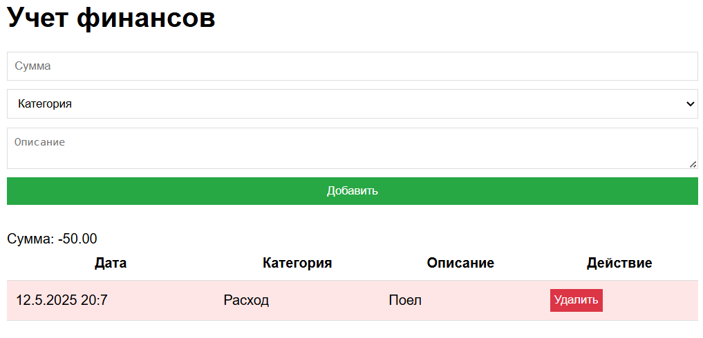

# Лабораторная работа №4: Работа с DOM-деревом и событиями в JavaScript

## Шклярук Артур IA2404

## Цель проекта

Проект представляет собой веб-приложение для учета личных финансов, созданное в рамках лабораторной работы №4. Основная цель — ознакомить студентов с основами взаимодействия JavaScript с DOM-деревом и обработки событий.

---

## Структура проекта

    /lab4

  ├── /src

  │   ├── index.js        # Главный файл, инициализация приложения

  │   ├── transactions.js # Логика работы с массивом транзакций

  │   ├── ui.js          # Работа с DOM (отрисовка таблицы, формы)

  │   ├── utils.js       # Вспомогательные функции

  ├── index.html         # Основная HTML-страница

  ├── style.css          # Стили приложения

  ├── README.md          # Документация проекта

---

## Установка и запуск

### Требования
- Любой современный веб-браузер (Chrome, Firefox и т.д.).

- Visual Studio Code с установленным расширением Live Server (рекомендуется для удобного запуска).

### Инструкции по запуску

1. **Склонируйте или скачайте проект:**

- Если проект загружен на GitHub, склонируйте его с помощью команды:

    ```bash
    git clone <ссылка_на_репозиторий>
    ```
- Либо скачайте ZIP-архив и распакуйте его.

2. **Откройте проект в Visual Studio Code:**

- Откройте папку lab4 в VS Code.


3. **Установите расширение Live Server (рекомендуется):**

- В VS Code откройте раздел расширений (Ctrl+Shift+X или Cmd+Shift+X на macOS).

- Найдите Live Server от Ritwick Dey и установите его.

4. **Запустите проект:**

- Щелкните правой кнопкой мыши на index.html в проводнике VS Code.

- Выберите "Open with Live Server".

- Проект откроется в браузере автоматически.

---

Примечание: Запуск через file:// (двойным кликом на index.html) не поддерживается из-за использования модулей ES (type="module"), что вызывает ошибки CORS. Используйте локальный сервер.

---

## Функционал приложения

### Добавление транзакции

- Форма позволяет ввести сумму, выбрать категорию и добавить описание.
- **Валидация**: сумма не должна быть 0, категория и описание обязательны.

### Отображение транзакций

- Таблица показывает дату, категорию, краткое описание (первые 4 слова) и кнопку удаления.
- Положительные суммы выделены **зелёным**, отрицательные — **красным**.

### Удаление транзакций

- Кнопка **"Удалить"** в каждой строке удаляет транзакцию из таблицы и массива.

### Подсчет суммы

- Общая сумма транзакций отображается над таблицей и обновляется при добавлении/удалении.

### Детали транзакции

- Клик на строку таблицы отображает полное описание транзакции ниже.

---

## Соответствие требованиям лабораторной работы

1. Создана структура проекта с модулями в `/src`, `index.js` подключен с `type="module"`.
2. Массив `transactions` содержит объекты с полями `id`, `date`, `amount`, `category`, `description`.
3. Таблица с колонками: **Дата**, **Категория**, **Описание**, **Действие**.
4. Функция `addTransaction` добавляет транзакции с цветовой индикацией и кратким описанием.
5. Кнопка удаления работает через делегирование событий на `<table>`.
6. Функция `calculateTotal` обновляет общую сумму.
7. Детали транзакции отображаются при клике на строку.
8. Форма с валидацией добавлена.
9. **Документация**: Все функции задокументированы с использованием JSDoc.

---

## Использование приложения

1. Откройте приложение через локальный сервер.
2. Заполните форму:
   - Введите сумму (например, `100`).
   - Выберите категорию (например, `Доход`).
   - Введите описание (например, `Зарплата`).
3. Нажмите **"Добавить"** — транзакция появится в таблице.
4. Кликните на строку — появятся полные детали.
5. Нажмите **"Удалить"** — транзакция исчезнет.

---

## Разбор кода

Проект разделен на модули для лучшей организации кода.

### `index.html`

- `<form id="transaction-form">` — форма для ввода данных.
- `<div id="total">` — отображение общей суммы.
- `<table id="transactions-table">` — таблица транзакций.
- `<div id="transaction-details">` — блок с деталями транзакции.
- Подключает `style.css` и `index.js` (type="module").

### `style.css`

- Минимальные стили для формы, таблицы и кнопок.
- Цветовая индикация:
  - `.positive` — зелёный
  - `.negative` — красный

### `src/utils.js`

Содержит вспомогательные функции:

- `generateId()` — создаёт уникальный ID (через `Math.random()`).
- `formatDate(date)` — форматирует дату в `ДД.ММ.ГГГГ ЧЧ:ММ`.
- `getShortDescription(text)` — возвращает первые 4 слова.

### `src/transactions.js`

Управление транзакциями:

- `transactions` — массив для хранения транзакций.
- `addTransaction(amount, category, description)` — создаёт и добавляет транзакцию.
- `deleteTransaction(id)` — удаляет по ID.
- `getTransactions()` — возвращает все транзакции.
- `calculateTotal()` — суммирует `amount` всех транзакций.

### `src/ui.js`

Взаимодействие с DOM:

- `renderTransactionRow(transaction)` — создаёт строку `<tr>`.
- `updateTable(transactions)` — перерисовывает таблицу.
- `updateTotal(total)` — обновляет сумму.
- `showTransactionDetails(transaction)` — показывает детали.
- `resetForm()` — сбрасывает форму.
- `showFormError(message)` — отображает сообщение об ошибке.

### `src/index.js`

Связывает логику и UI:

- `init()` — инициализация, установка обработчиков событий.
- `handleFormSubmit(e)` — обрабатывает форму, вызывает `addTransaction`, `updateTable`, `updateTotal`.
- `handleTableClick(e)` — обработка кликов: удаление и просмотр деталей.

---

## Взаимодействие модулей

- `index.js` импортирует `transactions.js` и `ui.js`.
- При отправке формы:
  - Валидируются данные.
  - Вызывается `addTransaction`.
  - Затем обновляется таблица и сумма (`updateTable`, `updateTotal`).
- При клике по таблице:
  - Если клик по **"Удалить"** — `deleteTransaction`, перерисовка таблицы и суммы.
  - Если клик по строке — `showTransactionDetails` отображает описание.
- Функции из `utils.js` используются в других модулях.

---

## Пара скриншотов работы с приложением

1. **Изначальный вид сайта**



2. **Выбор категории**


3. **Добавление дохода**



4. **Добавление расхода**


5. **Проверка информации по оплате (лкм)**



6. **Удаление информации по оплате (нажать на кнопку "Удалить")**



---

## Вывод

Проект успешно демонстрирует практическое применение JavaScript для работы с DOM и событиями, закрепляя у студентов базовые навыки динамического взаимодействия с веб-страницей.

---